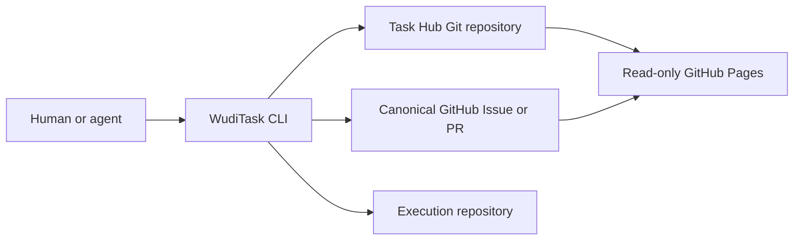
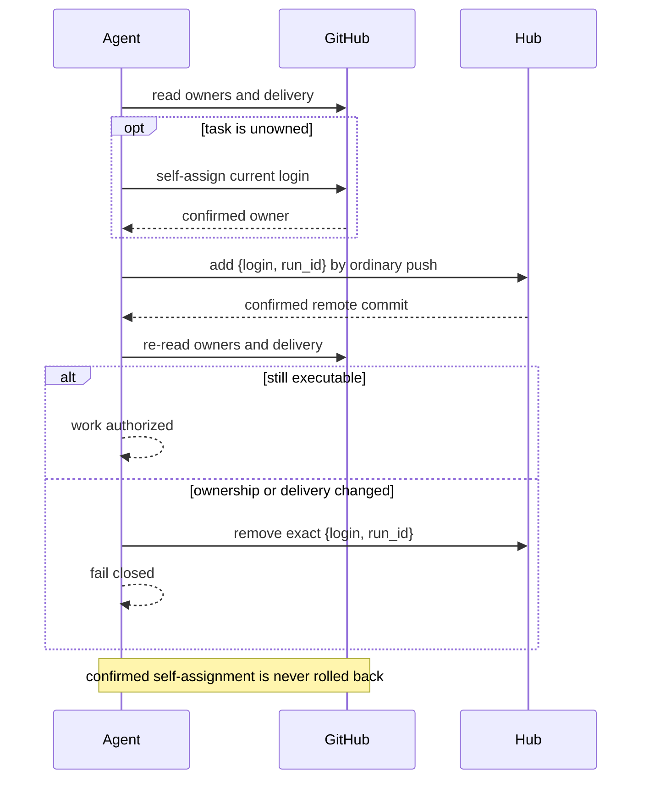

# 架构与并发模型

## 目标

WudiTask 用 GitHub Issue/PR 承载业务合同，用独立 Git Hub 承载跨仓依赖、多个
agent runs 和审计归档。它不需要常驻服务，同时避免把 assignment、execution
和 acceptance 复制成多套事实源。

## 组件

### Canonical GitHub source

GitHub 保存 title/body、acceptance、assignees、PR author、reviews、checks 与交付
终态。owner 是实时派生值：

- PR source：author + PR assignees；
- Issue source：Issue assignees + closing-linked PR authors；普通 mention 不产生
  owner。

Hub Issue 可以作为 fallback canonical source；不存在 text source。

### Task Hub

Hub schema v3 / tool API v4 的 task 文件只保存 repo、source、creator login、
priority、created_at、dependencies 和 `active_agents`。一任务一文件让不同 task
写入尽量不冲突。archive 保存 completion/evidence/participants，deletion receipt
永久保留显式删除的 ID。

### Agent access

安装配置只记录工具 clone 与独立 Hub remote/branch。长期 bare cache 按
remote+branch 分桶，每次命令创建独立 worktree，并以本机 operation lock 防止
清理仍活跃的进程。十二个 skill 通过符号链接同时注册给 Codex 和 Claude。

### Pages

Pages workflow checkout Hub 和固定工具 SHA，先 validate 再构建 snapshot v3。
网页只读，展示 owners 和 active-agent logins，但不发布 run_id。source body、
completion evidence 和 private delivery 元数据都属于可能公开的数据。

## Ownership 与 execution 分离

`assign/unassign` 是显式 GitHub assignee 操作；`release` 只普通 push Hub。
`execute` 自动选择 unowned task，或显式选择当前 login 尚非 owner 的 task 时，
先完成 GitHub self-assignment，再独立启动 Hub run。
两者没有跨仓原子事务，也不假装有：

无 ID execute 先选 assigned-to-self idle task，再选 unowned task。只由其他人拥有
的任务不会被自动采用；显式 task ID 则允许先添加当前 login 为 co-owner，再走
self-assignment phase。若 Hub
start 失败，GitHub assignment 保留并明确报告未启动。unassign 在目标 login
active 时拒绝；release 即使 GitHub 不可用也能清除自己的精确 run。

## Active-agent 集合并发

每项为 `{login,run_id}`。login 不区分大小写且最多一项；不同 login 可以同时
存在。run_id 是一次执行 generation，解决同一 login 的 ABA：旧 release/archive
不能作用于后来启动的新 run。

远端写流程：

1. fetch Hub 默认分支；
2. 从精确 commit 建 operation worktree；
3. validate schema、dependencies 与目标 precondition；
4. 仅修改目标 task path；
5. 普通 push；non-fast-forward 时从新快照重放完整 operation；
6. 远端读取验证 task 的完整 postcondition。

不同 login 同时 execute 同一 task 时，两次操作是集合 add；后 push 的一方重放
后保留前一项。相同 login 同时 execute 时只能有一项，另一方得到
`active_agent_conflict`。release 只删除 matching login/run_id，不覆盖其他 add。

Hub push 失败不必然表示未接受。CLI 用远端 postcondition 区分已确认、未提交和
未知；未知时 fail closed，调用方用相同 run_id 重试，不能生成第二个 run。

## Dependencies 与 archive

dependencies 使用 WudiTask ID。open、missing、failed、cancelled 或 cyclic
dependency 都阻止 execute；只有 archive `done` 且 completion 合法才解锁下游。

acceptance 只在 source。archive done 实时确认 Issue completed 或 PR merged，
要求至少一条 evidence 和 caller matching run_id。一个 Hub commit 把 open 文件
移动到 archive、清空 active_agents，并把当时所有 login/run_id 保存为
completion participants。failed/cancelled 保留历史但不解锁依赖；若存在 active
agents，同样要求 caller 的 matching login/run_id 并清空全集。若没有 active
agent，则只有 authenticated `created_by` 可以对已明确终态的任务归档，且必须
省略 run_id；旧 run_id 会被拒绝而不是忽略，participants 为空。这允许未认领或
已 release 的取消/失败任务结束生命周期，同时不允许其他 login 借终态关闭任务。

显式 delete 是 archive rename 以外的例外：完整批次预检后，一个 commit 删除
目标并写 deterministic receipt。receipt 覆盖的 ID 永久保留，阻止 ABA 重建。

## 原子性边界

系统承诺：

- Hub 永不 force-push；
- 每次重试从新快照重放 target/dependency/run guards；
- 一个 agent 的操作不覆盖其他 login 的 entry；
- active agents 存在时，stale run_id 不能 release/archive 新 run；
- archive done 要求 terminal GitHub delivery 与 evidence；
- 无 active agent 的 failed/cancelled archive 只允许 task creator；
- schema、DAG 和 Pages 在 CI 中统一验证。

系统不承诺：

- GitHub assignment 与 Hub execution 的跨仓原子提交；
- 工作仓代码提交与 Hub archive 的两阶段提交；
- GitHub 不可达时的新 execute 或 done archive；
- 网络中断后立即知道 push 是否被服务端接受。

## 分支与版本

Hub 默认分支需要授权参与者普通 push，以 Hub commit 作为 agent-set 和 archive
确认点。禁止 force push、默认分支删除与 mirror push；若组织强制所有 Hub 写入
走 PR，本协议不能提供低延迟协调，应使用服务端事务系统。

工具仓与 Hub 是不同安全域。工具维护通常普通 push；明确改写 agent-owned tool
branch 时才允许带已观察旧 OID 的精确 `--force-with-lease`。该权限绝不传播给
Hub。

v3/API4 是无兼容 cutover。Hub 必须在一个 commit 中迁移 manifest、所有 task
和 Pages pinned tool SHA；旧工具随后应拒绝 Hub，而不是猜测或双写旧字段。

## 可用性与隐私

Git origin 是 coordination plane，GitHub API 是 owner/delivery plane。GitHub
unavailable 时 read view 显示 unknown，新 execute 和任何 archive fail closed；
已知 run 的 release 只依赖 Hub，仍可执行。

private source 需要 Hub workflow 的最小只读 token。Pages snapshot 可包含 source
body、owners、linked PR、reviews/checks、active logins、completion evidence 与
query errors；run_id 只保留在 Hub JSON/CLI，不进入 Pages。不要把 Pages 误当成
天然私有站点。
