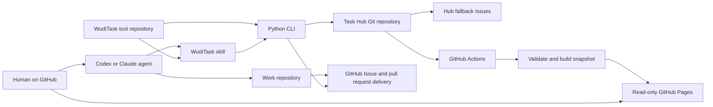

# 架构与并发模型

## 目标

WudiTask 解决的是“多个机器上的多个 agent 如何共享任务，并确保同一任务只有一个已确认领取者”。它有意不追求数据库级全局事务：冲突概率应通过一任务一文件降到很低；发生冲突时必须可检测、可重试、不得静默覆盖。

## 组件



### Task Hub

Task Hub 是 coordination 状态的事实源；GitHub Issue/PR 是 delivery 状态的
事实源。Hub Git tree 包含：

- `hub.json`：严格的 task schema 与 tool API 版本契约。
- `data/`：业务数据。
- `.github/workflows/pages.yml`：用固定工具版本校验、构建与部署。

Hub 的 GitHub Issues 是 canonical narrative 的 fallback tracker，属于服务端
元数据，不进入 Git tree，也不会与 task-data push 竞争。

工具仓保存 CLI、skills、schema、dashboard 源码和测试。安装配置 schema v2
分别记录 `tool_path/tool_remote/tool_branch` 与
`hub_remote/hub_branch`。CLI 不从工具仓的 origin 推断 Hub；Hub 任务提交
也不会推进工具仓 HEAD。

两套 Git 历史采用不同策略：

| 仓库 | 默认写入 | 历史改写 |
| --- | --- | --- |
| Task Hub | 普通 fast-forward push | 服务端禁止 non-fast-forward 和 force push |
| WudiTask 工具仓 | 普通 push | 明确维护时允许带精确旧 OID 的 `--force-with-lease` |

工具仓的例外只用于代码历史维护，不进入任务并发协议，也不能以 remote 名称、
本地 clone 或其他配置间接套用到 Task Hub。

`hub.json` 只允许当前工具认识的精确字段和值。缺失、额外字段或版本不匹配
都会在读写前失败；系统没有旧 Hub fallback 或隐式迁移路径。

远端 Hub 的本地副本只是可删除 cache。CLI 按 remote 和 branch 的哈希在
`${XDG_CACHE_HOME:-$HOME/.cache}/wuditask/hubs/` 保存 bare repository；配置
仍只记录远端，不记录 cache 路径。每条命令 fetch 最新远端 commit，并在唯一
operation worktree 中读取或修改。命令结束后删除 worktree，Git objects 留在
cache 中供后续命令复用。bare cache 首次初始化在同级 staging 目录完成，再
原子 rename 到最终 hash 路径，初始化中断不会留下被误认成有效 cache 的半成品。

### Work repository

工作仓库不保存 WudiTask 锁文件，也不需要安装 SDK。agent 在工作仓库中读取 origin，以 `owner/name` 匹配 Task Hub 中的任务，然后在该工作仓库完成代码与验证。

### GitHub Pages

Pages 是派生视图，不是写入 API。Hub Actions checkout 一个固定的工具完整
commit SHA，使用该版本的 validator 与 `site/` 从已提交 JSON 构建
`snapshot.json`。`_site` 只作为 artifact 上传，不提交回 Task Hub。即使
Pages 暂时不可用，CLI 与 Git 协议仍可运行。

## Task Hub 普通 push 的乐观并发

每个远端写命令执行同一套事务：

1. 在对应的持久 bare cache 中 fetch 配置的 `hub_remote/hub_branch`。
2. 从 fetch 得到的精确 commit 创建唯一的 detached operation worktree。
3. 在 worktree 中重新检查 schema、claim 和依赖。
4. 只修改目标任务文件，并用当前 human identity 创建 Git commit。
5. 执行普通 `git push`，显式关闭 force、force-with-lease、mirror 与
   follow-tags，只推进配置的 Hub branch。
6. push 成功后返回 `sync.confirmed=true`；工具 clone 不执行 refresh。
7. 删除 operation worktree；bare cache 继续保留。
8. 如果因 non-fast-forward 被拒绝，从第 1 步重新 fetch、重新判断并重放。

```mermaid
sequenceDiagram
  participant A as Agent A
  participant B as Agent B
  participant C as Local bare cache
  participant O as Git origin
  A->>O: fetch latest into cache
  B->>O: fetch latest into cache
  C-->>A: detached worktree A
  C-->>B: detached worktree B
  A->>A: claim task T
  B->>B: claim task T
  A->>O: ordinary push
  O-->>A: accepted
  B->>O: ordinary push
  O-->>B: rejected, fetch first
  B->>O: fetch latest and create a new worktree
  O-->>B: T already has claim
  B-->>B: return claim_conflict; do not work
```

同一 cache bucket 的跨进程锁只覆盖初始化、fetch 和 worktree add/remove；任务
判断、commit 与 push 不持锁，因此同机 agent 仍然按远端普通 push 乐观竞争。
不同 operation 也不写共享 repository 的 `user.name/user.email`，commit identity
只通过该次 Git 命令传入。每个 operation 在整个生命周期持有唯一 lease；后续
命令只清理能够非阻塞取得 lease 的 orphan，因此进程崩溃后的 checkout 会被
回收，同时不会误删仍在运行的并发 worktree。

Hub push 不依赖环境中的 Git 默认值：命令同时覆盖
`remote.origin.mirror=false`、`push.followTags=false`，并传入
`--no-force`、`--no-force-with-lease`、`--no-mirror` 与
`--no-follow-tags`。因此全局或 cache-local Git 配置不能把一次单分支普通
push 隐式扩大成 mirror、force 更新或额外 tag 写入。push 直接使用配置的
`hub_remote`，不通过 remote 名 `origin`，因此 `remote.origin.pushurl` 也不能
把一次已确认任务写入重定向到其他仓库。

### Push 失败不总等于“没抢到”

non-fast-forward 只说明远端变了，可能是另一台机器修改了完全不同的任务。WudiTask 会自动重试：

- 若目标任务仍为空：重放本次修改并再次普通 push。
- 若目标任务已被他人领取：返回 `claim_conflict`，确认没有抢到。
- 若只是其他任务变化：通常第二次 push 会成功。
- 若网络、认证或服务端状态不明确：返回 `push_status_unknown`，fail closed；agent 不得开始工作，应重试同一命令确认远端状态。

因此真正的开工条件不是“本地 JSON 已改”或“第一次 push 没报错”，而是命令返回：

```json
{
  "ok": true,
  "confirmed": true,
  "sync": {
    "confirmed": true
  }
}
```

## 为什么一任务一文件

两个 agent 领取不同任务时会修改两个路径。第一次 push 后，第二次虽然会遇到 branch head 变化，但从新快照重放时不会产生内容冲突。只有同时操作同一个任务才会竞争同一路径与 claim 条件。

archive 是同一事务中的 rename：`data/open/<id>.json` 变为 `data/archive/<year>/<id>.json`。Git 历史保留完整轨迹。

## 原子性边界

系统不承诺：

- 跨 GitHub 仓库的原子提交。
- 工作仓库代码与 Task Hub archive 的两阶段提交。
- GitHub 服务不可达时的离线领取。
- 网络中断后立即知道 push 是否已被服务端接受。

### GitHub delivery 与 Hub claim

`execute` 在 Hub 中取得强唯一 lease，并以 canonical Issue/PR 的实时状态作为
外部 guard。未指派 Issue 的流程是：读取 GitHub → 普通 push claim → 指派当前
用户 → 再读 GitHub；已有 assignee 或 PR source 也必须在 push 后重读。指派失败
或二次读取出现其他 owner 时，CLI 使用本次 claim token 补偿 release；无法确认
GitHub cleanup 时保留 lease 并要求 reconcile。不存在跨仓原子提交。

`release` 反向执行：对 Issue 先移除当前 assignee 并重读，再普通 push 清 lease；
Hub push 未确认时保留 locked/unknown 状态并要求重试或 reconcile，避免猜测
跨仓结果。当前用户仍拥有 active closing PR 时拒绝宣称任务已经回队列。local
mode 从不执行这些 GitHub mutation。

`archive done` 也实时读取 delivery：只有 canonical Issue 当前 completed（通常
由 closing PR merge 触发），或 canonical PR merged，才进入 WudiTask 验收。
Issue 一旦 open/reopened 就仍是 active，即使保留历史 merged closing PR。GitHub
完成不自动产生 evidence，也不自动解除依赖。

系统承诺：

- 不 force-push Task Hub。
- 未确认 claim 时 agent 不开工。
- 每次远端重试都重新检查目标任务，而不是盲目重放旧文本。
- human authorization 使用不可变 GitHub numeric ID；login 改名时刷新显示字段。
- archive done 必须有完整验收证据。
- failed/cancelled 不解除依赖。
- 数据格式、依赖图与 Pages 构建在 CI 中统一验证。

这是有意选择的低复杂度模型：允许极低概率、可见且可恢复的冲突，不引入常驻协调服务器。

## 分支配置

Task Hub 的默认分支应允许被授权参与者直接普通 push，因为 claim 的确认点就是该 push。推荐分支规则：

- 禁止 force push。
- 禁止删除默认分支。
- 限制谁可以 push。
- 启用 secret scanning 与审计（组织能力允许时）。
- 不要求每个 task claim 走 pull request。

如果组织策略强制所有修改通过 PR，则本协议不能提供低延迟唯一领取；应改用 GitHub Issues/Projects 的服务端原子 API 或专用协调服务。

这些分支规则只约束 Task Hub。工具仓是可重新发布的代码，默认仍应普通 push，
但维护者可以在明确审查改写范围后使用
`--force-with-lease=refs/heads/<branch>:<observed-oid>`。工具仓规则可以保留
分支删除保护，但不应启用禁止 non-fast-forward 的规则。lease 不匹配时必须
停止并检查新提交，不能自动更新 expected OID 后重试。比较工具仓与 Hub 时
必须使用 canonical 仓库身份，不能把同一 GitHub 仓库的 SSH/HTTPS URL 当成
不同仓库。若配置的工具分支被改写，现有安装的普通 selfupdate 保持
fail-closed；改写远端历史不隐含 reset 本地安装的授权。

## 可用性与隐私

Git origin 是协调面，GitHub API 是 delivery guard。任一短时不可用时新 claim
fail closed；GitHub-backed done archive 也等待 delivery 恢复。已确认 lease 的
本地实施可以继续。

私有 Task Hub 可以限制 JSON 访问，但 Pages 的访问级别必须单独判断。跨仓私有
source 需要 Hub workflow 的只读 token；没有权限时 delivery 显示 unavailable。
默认把 title、goal、context、claim identity、evidence、canonical source
repo/URL、assignees、closing PR author/URL、review/check 摘要、delivery 时间和
查询错误都视为可能被 Pages 读者看到。跨仓私有 token 至少需要 repository
metadata、Issues、pull requests、checks 与 commit statuses 的只读权限；公开
Pages 必须脱敏，敏感任务应使用真正受限的 Pages。
